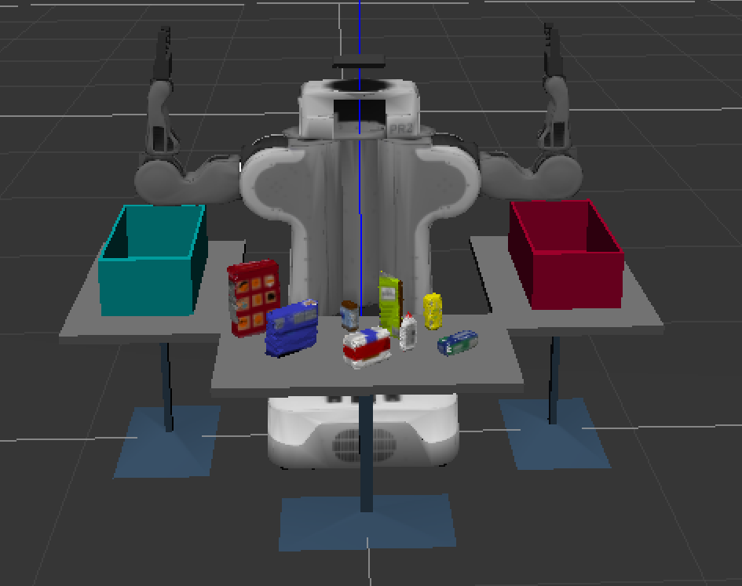
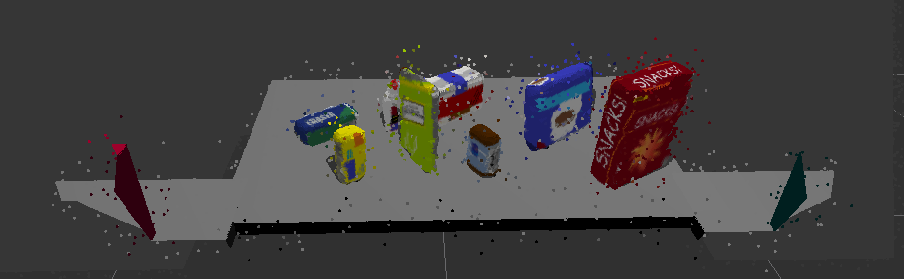
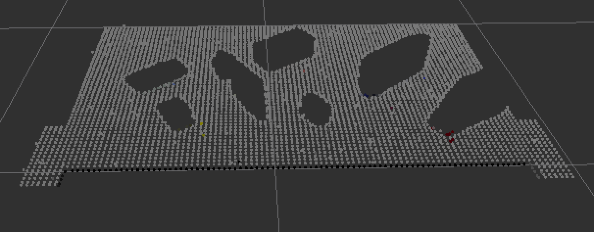
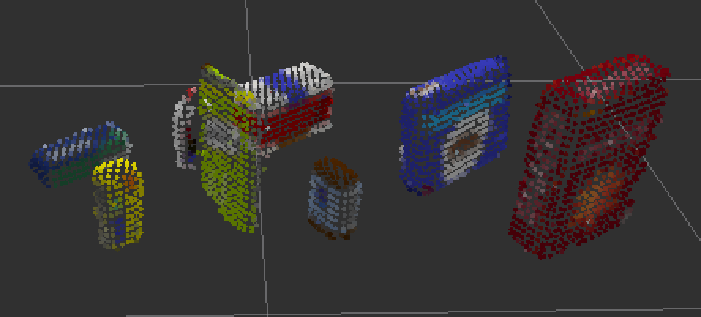
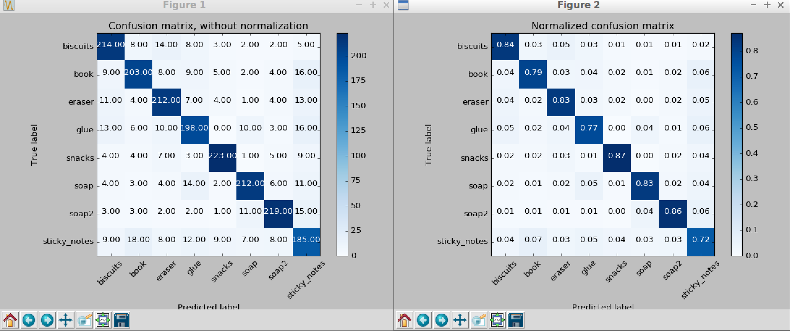
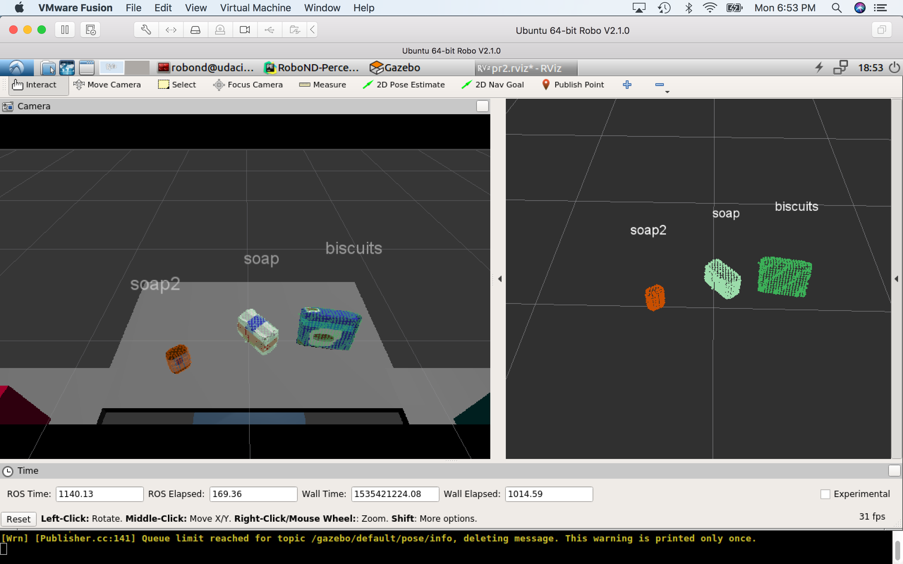
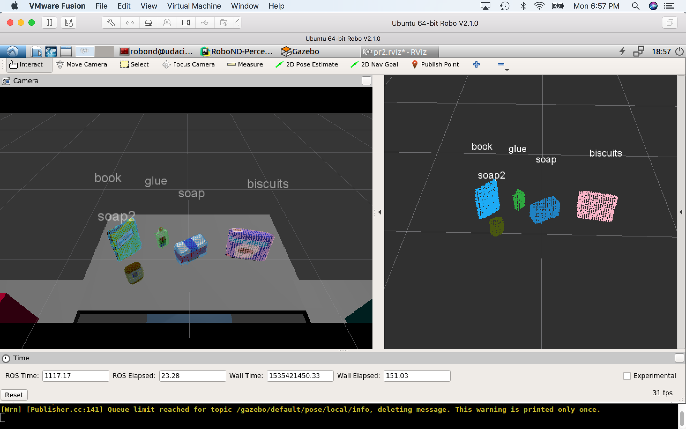
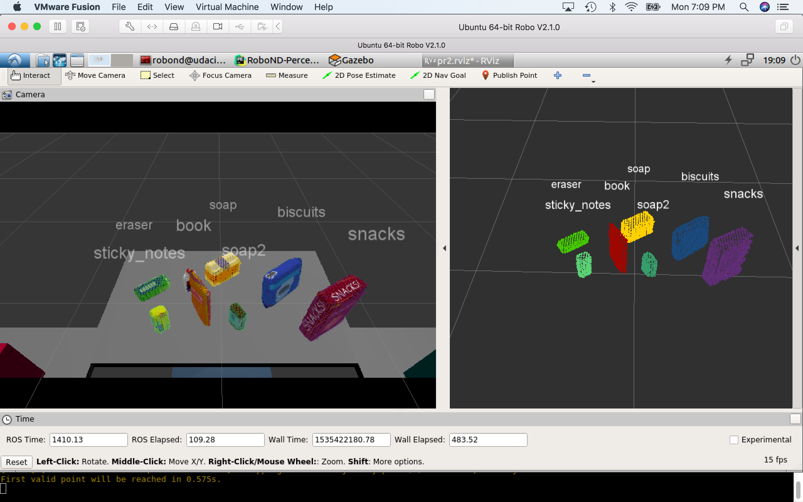

## Project: Perception Pick & Place
### Saminda Abeyruwan
---

I have approached the "Perception Pick & Place" project as an extension of the Exercise-3, [RoboND-Perception-Exercises](https://github.com/samindaa/RoboND-Perception-Exercises). After cloning, [https://github.com/samindaa/RoboND-Perception-Exercises](https://github.com/samindaa/RoboND-Perception-Project), all the necessary resources -- src, srv, msg, and scripts -- have been copied and updated to __pr2_robot__ ROS package. The following files are my contributions:

* [project\_pr2\_robot.py](https://github.com/samindaa/RoboND-Perception-Project/blob/master/pr2_robot/scripts/project_pr2_robot.py): perception pipeline. 
*  [train_svm.py](https://github.com/samindaa/RoboND-Perception-Project/blob/master/pr2_robot/scripts/train_svm.py): training file.
*  [capture_features.py](https://github.com/samindaa/RoboND-Perception-Project/blob/master/pr2_robot/scripts/capture_features.py): training example generation file. 
*  [features.py](https://github.com/samindaa/RoboND-Perception-Project/blob/master/pr2_robot/src/pr2_robot/features.py): captures features of the voxel map.
*  [model\_list5\_vox.sav](https://github.com/samindaa/RoboND-Perception-Project/blob/master/pr2_robot/scripts/model_list5_vox.sav): trained model.
*  [training.launch](https://github.com/samindaa/RoboND-Perception-Project/blob/master/pr2_robot/launch/training.launch): ROS training example generation launcher. 
*  [output_1.yaml](https://github.com/samindaa/RoboND-Perception-Project/blob/master/pr2_robot/config/output_1.yaml): project submission file for test1.world.
*  [output_2.yaml](https://github.com/samindaa/RoboND-Perception-Project/blob/master/pr2_robot/config/output_2.yaml): project submission file for test2.world.
*  [output_3.yaml](https://github.com/samindaa/RoboND-Perception-Project/blob/master/pr2_robot/config/output_3.yaml): project submission file for test3.world.

The project is based of off a PR2 robot that picks objects, such as soap, and snack, and place them in buckets at its right and left sides. The following image shows the PR2 robot is at the rest position in the test3.world. 

 

The PR2 consists of a RGBD camera, and the output is noisy similar to a real world sensor. The following figure shows an example output:

__pcl_callback()__ contains all the constructs from Exercise-3 with the following modifications.

1. In order to compensate for the noise, I have used statistical outlier filter. It is evident from the experimentation that a mean value between 10 and 15, and standard deviation 0.1 provided the best values. I have used mean value 10.
2. The voxel leaf size has been set to 0.01.
3. I have used two pass through filter in the directions: __z__ and __y__. __z__ has been set similar to the Exercise-3. As you see from the above figure, at ready pose, the two sides of the bins show up in the voxel maps. Therefore, I have added another pass through filter in __y__ direction, and set the filter limits to -0.5 and 0.5.
4. After running RANSAC for plane filtering, I have obtained the inliers and outliers as follows. For example, test3.world,

Inliers:

Outliers:

5. Finally, I have used  Euclidean clustering to obtain potential clusters (more information available in the following discussion).

The next step is to develop the model to classify voxel clusters to named objects via a machine learning model. First, we need to create a training set of the interested objects, and define or learn the features that describe those objects. I have used the framework provided in the Exercise-3 to generate objects and capture features with my modfications.

The features are developed in __features.py__. I have used HSV color histogram, [compute\_color\_histograms](https://github.com/samindaa/RoboND-Perception-Project/blob/master/pr2_robot/src/pr2_robot/features.py#L13), and normal histogram, [compute\_normal\_histograms](https://github.com/samindaa/RoboND-Perception-Project/blob/master/pr2_robot/src/pr2_robot/features.py#L51), and concatenate them to obtain the feature vector. I have selected 8 objects: __biscuits__, __soap__, __soap2__, __book__, __glue__, __sticky_notes__, __snacks__, and __eraser__, and trained a __single__ model. 

__capture_features.py__ has spawned the objects in a ROS environment setup by __training.launch__ launcher. I have collected 256 training examples per object with a random pose with an initial position (0.55, 0, 0.65) (please see [training_helper.py](https://github.com/samindaa/RoboND-Perception-Project/blob/master/pr2_robot/src/pr2_robot/training_helper.py#L96)).

I have used the noisy RGBD camera to capture the objects. Therefore, unlike the Exercise-3, I have used preprocessing similar to the perception pipeline, but, up to creating a VoxelGrid filter to obtain the resultant downsampled point cloud (please see [here](https://github.com/samindaa/RoboND-Perception-Project/blob/master/pr2_robot/scripts/capture_features.py#L102)).

I have used svm.LinearSVC, and the best results have been obtained with a C value of 25. The classifier has achieved an accuracy about 81%. The confusion matrix is as follows:

The svm.LinearSVC model has performed accurately and consistently within the test worlds, as evident from the following results.  

### test1.world

Accuracy: 100%

Output: [output_1.yaml](https://github.com/samindaa/RoboND-Perception-Project/blob/master/pr2_robot/config/output_1.yaml)

### test2.world

Accuracy: 100%

Output: [output_2.yaml](https://github.com/samindaa/RoboND-Perception-Project/blob/master/pr2_robot/config/output_2.yaml)

### test3.world

Accuracy: 87.5%

Reason: Only 7 clusters were formed. All 7 clusters were classified 
correctly. Glue was occluded by book, so it was not detected by my parameter settings. 

Output: [output_3.yaml](https://github.com/samindaa/RoboND-Perception-Project/blob/master/pr2_robot/config/output_2.yaml)

